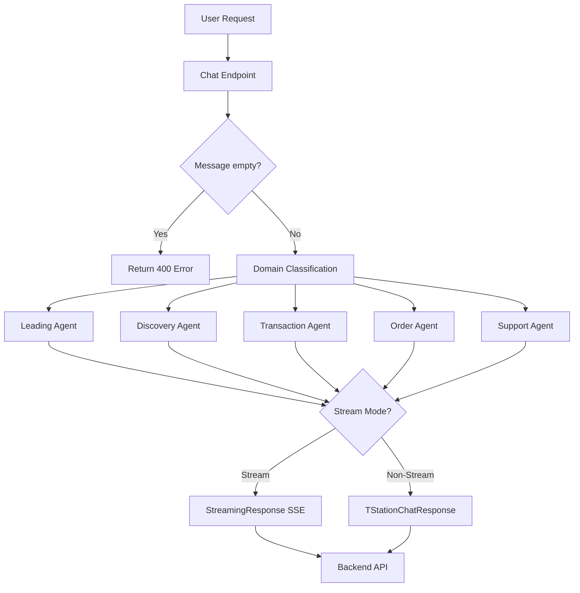
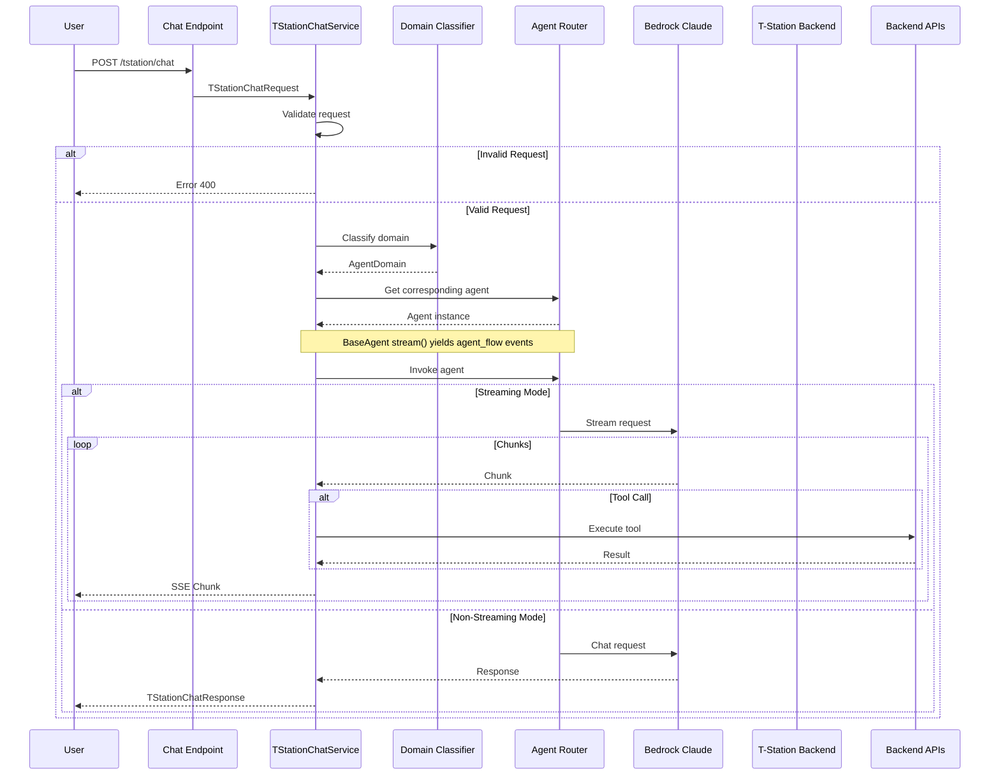

# T-Station AI Chat Documentation

## Overview

T-Station AI is an intelligent tire shopping assistant for Hankook Tire Korea. This service provides multi-domain chat capabilities with FastAPI to handle customer inquiries about tires, including product recommendations, compatibility checks, pricing, store information, FAQ support, and order management.

**Main file**: `app/tstation-ai/services/tstation/chat.py`

## Features

- ✅ Multi-agent architecture with intelligent routing
- ✅ Automatic domain classification (leading, discovery, pricing, order, support)
- ✅ Support for streaming and non-streaming modes
- ✅ LangChain agents integration with LiteLLM
- ✅ Bedrock Claude Haiku 4.5 as LLM
- ✅ Langfuse tracing integration
- ✅ Backend API integration (Oracle DB)
- ✅ BaseAgent with TOOL_TO_AF_MAP for agent function tracking
- ✅ Streaming with agent_flow events showing current agent/AF and status

## Architecture



## Workflow Sequence



## Core Components

### 1. BaseAgent (`base_agent.py`)

Base class for all agents with streaming support and AF mapping.

```python
class BaseAgent(ABC):
    TOOL_TO_AF_MAP: dict[str, str] = {}

    def __init__(self, model, tools: list | None = None, system_prompt: str = "", name: str = ""):
        self.name = name
        self.agent = create_agent(model=model, tools=tools, system_prompt=system_prompt, name=name)

    def stream(self, messages: list[dict]):
        yield {"type": "agent_flow", "agent": f"[{self.name}]", "status": "active"}
        for mode, chunk in self.agent.stream(...):
            # Yield agent_flow with tool status
            yield {"type": "agent_flow", "agent": f"[{af} AF]", "status": tool_status}
            yield {"type": "token", "content": ...}
```

**Streaming Events**:
- `agent_flow`: `{"type": "agent_flow", "agent": "[Discovery Agent]", "status": "success/error"}`
- `token`: AI response tokens
- `message`: Agent messages with agent name
- `tool`: Tool execution results with tool name and AF

### 2. TStationChatService

Main service class handling all chat operations.

#### Methods

##### `chat(request: TStationChatRequest)`

Main entry point for chat requests.

**Workflow**:
1. Validate request
2. Check messages not empty
3. Classify message domain
4. Get corresponding agent
5. Invoke agent (stream or non-stream)

**Parameters**:
- `request`: `TStationChatRequest` containing messages, stream, session_id

**Returns**:
- Non-stream: `TStationChatResponse`
- Stream: `StreamingResponse` with SSE format

##### `classify_domain_request(request: TStationChatRequest) -> AgentDomain.Domain`

Classifies message domain using LLM with structured output.

**Supported domains**:
- `leading`: Greetings, general questions, unclear intent
- `discovery`: Product recommendations, compatibility checks, product comparisons
- `pricing`: Price lookup, stock checking, store information
- `order`: Purchase intent, quick order, order tracking
- `support`: Policies, warranty, complaints, escalation

**Classification rules**:
- Highest priority: Escalation → support
- Clear purchase intent → order
- Price/Stock/Store → pricing
- Recommendation/Compatibility → discovery
- Unclear → leading

**Returns**:
- `AgentDomain.Domain` enum

##### `_stream_response(agent, request: TStationChatRequest)`

Handles streaming response.

**Workflow**:
1. Stream from agent
2. Yield JSON events including agent_flow
3. Send [DONE] when complete

**SSE Format**:
```json
{"type": "agent_flow", "agent": "[Discovery Agent]", "status": "success"}
{"type": "agent_flow", "agent": "[Product Compatibility AF]", "status": "success"}
{"type": "token", "content": "..."}
{"type": "tool", "tool": "get_compatibility_tool", "content": "..."}
```

### 3. AgentDomain

Domain classification model with Pydantic.

```python
class AgentDomain(BaseModel):
    class Domain(str, Enum):
        LEADING = "leading"
        DISCOVERY = "discovery"
        PRICING = "pricing"
        ORDER = "order"
        SUPPORT = "support"

    reason: str = Field(default="", description="Reason for the classification")
    confidence: float = Field(default=0.0, description="Confidence of the classification")
    domain: Domain = Field(default=Domain.LEADING, description="Domain of the conversation")
```

### 4. Router

Routes agent based on domain.

```python
def get_agent(self):
    if self.domain == self.Domain.DISCOVERY:
        return discovery_subagent
    elif self.domain == self.Domain.PRICING:
        return pricing_subagent
    elif self.domain == self.Domain.ORDER:
        return order_subagent
    elif self.domain == self.Domain.SUPPORT:
        return support_subagent
    else:
        return leading_agent
```

## Agents

All agents inherit from `BaseAgent` and define `TOOL_TO_AF_MAP`.

### Leading Agent (`a_leading_agent/`)

- Central orchestrator for all chat requests
- Handles greeting, general questions, unclear intent
- Fallback when no domain matches
- No tools, direct LLM response

### Discovery Agent (`b_discovery_agent/`)

- Product recommendations based on vehicle, driving conditions
- Tire-vehicle compatibility checks
- Detailed product descriptions

**TOOL_TO_AF_MAP**:
```python
TOOL_TO_AF_MAP = {
    "get_compatibility_tool": "Product Compatibility",
    "post_vehicle_verify_owner_tool": "Product Compatibility",
    "get_compatible_product_tool": "Product Compatibility",
    "get_user_vehicles_tool": "Product Compatibility",
    "get_products_recommendations_tool": "Product Recommendation",
    "get_product_description_tool": "Product Description",
}
```

### Pricing Agent (`c_pricing_agent/`)

- Price lookup
- Stock checking (logistics, MD, store)
- Store information

**TOOL_TO_AF_MAP**:
```python
TOOL_TO_AF_MAP = {
    "get_final_price_tool": "Price",
    "get_logistics_inventory_tool": "Inventory",
    "get_md_inventory_tool": "Inventory",
    "get_store_inventory_tool": "Inventory",
    "get_nearby_stores_tool": "Store",
    "get_store_list_tool": "Store",
    "get_store_detail_tool": "Store",
}
```

### Order Agent (`d_order_agent/`)

- Quick order creation
- Order tracking
- Delivery status

**TOOL_TO_AF_MAP**:
```python
TOOL_TO_AF_MAP = {
    "get_nearby_stores_tool": "Store",
    "get_store_details_tool": "Store",
    "get_store_list_tool": "Store",
    "create_order_draft_tool": "Quick Order",
    "get_order_status_tool": "Order / Delivery",
}
```

### Support Agent (`e_support_agent/`)

- FAQ lookup
- Escalation to human agent

**TOOL_TO_AF_MAP**:
```python
TOOL_TO_AF_MAP = {
    "get_faq_tool": "FAQ",
    "escalate_tool": "Escalation",
}
```

## Agent Flow Streaming

When streaming, the service yields agent_flow events showing current active agent/AF:

```python
# Agent starts
{"type": "agent_flow", "agent": "[Discovery Agent]", "status": "success"}

# Tool called - AF status from tool result
{"type": "agent_flow", "agent": "[Product Compatibility AF]", "status": "success"}
{"type": "tool", "tool": "get_compatibility_tool", "content": "..."}

# Another tool
{"type": "agent_flow", "agent": "[Product Recommendation AF]", "status": "success"}
{"type": "tool", "tool": "get_products_recommendations_tool", "content": "..."}

# Final response
{"type": "token", "content": "Here are the recommended tires..."}
```

**Status Colors (UI)**:
- Success: Green (#16a34a)
- Error: Red (#dc2626)

## System Prompts

### Domain Classification Prompt

Classifies messages into 5 domains with clear priority rules.

**Priority Rules**:
1. Escalation request → support (highest)
2. Clear purchase intent → order
3. Price/Stock/Store → pricing
4. Recommendation/Compatibility → discovery
5. General/Unclear → leading

### Agent Prompts

Each agent has its own system prompt defining:
- Role and function
- Capabilities and limitations
- Available tools
- Safety rules

## Request/Response Models

### TStationChatRequest

```python
class TStationChatRequest(BaseModel):
    messages: List[Union[HumanMessage, AIMessage, SystemMessage]]
    stream: bool = False
    session_id: Optional[str] = None
    user_id: Optional[str] = None
    metadata: Optional[dict] = None
```

### TStationChatResponse

```python
class TStationChatResponse(BaseModel):
    content: str
```

## Configuration

| Environment Variable | Description |
|---------------------|-------------|
| ENV | Environment mode (local, dev, staging, prod) |
| AI_DEFAULT_PROVIDER | LLM provider (default: openai) |
| REDIS_URL | Redis connection for queue |
| AWS_BEARER_TOKEN_BEDROCK | AWS Bedrock authentication |

## External Integrations

| Service | Purpose | Provider |
|---------|---------|----------|
| Bedrock Claude Haiku 4.5 | LLM for AI responses | AWS |
| LiteLLM | Unified LLM interface | LiteLLM |
| Langfuse | Tracing and observability | Langfuse |
| Redis | Queue system | Redis |
| Oracle | Product/customer data | Oracle |

## Monitoring

- Health checks: `/health` endpoint
- Metrics: Prometheus format at `/metrics`
- Tracing: Langfuse integration
- Logging: Structured logging with log levels

## Recent Changes

### Current Version
- Added BaseAgent as base class for all agents
- Added TOOL_TO_AF_MAP for agent function tracking
- Added agent_flow streaming events with status
- Updated UI to display agent flow with colored badges
- Status extracted from tool result (success/error)
