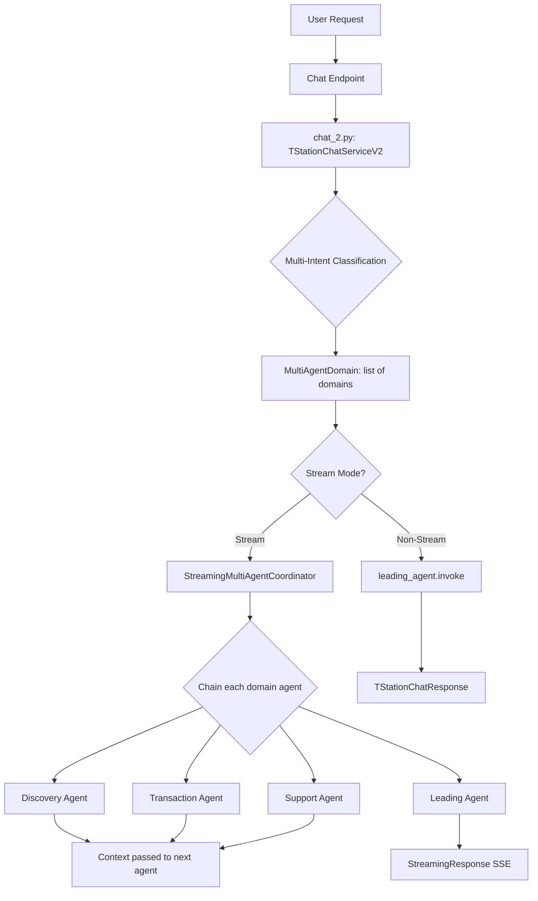
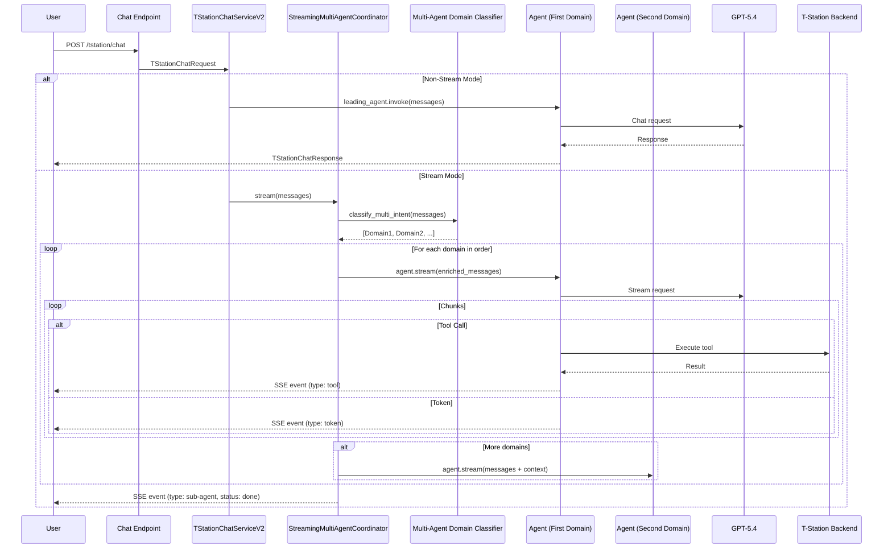

# T-Station AI Chat Documentation

## Overview

T-Station AI is an intelligent tire shopping assistant for Hankook Tire Korea. This service provides multi-domain chat capabilities with FastAPI to handle customer inquiries about tires, including product recommendations, compatibility checks, pricing, store information, FAQ support, and order management.

**Main file**: `app/tstation-ai/services/tstation/chat.py`

## Features

- ✅ V2 multi-agent streaming with multi-intent detection
- ✅ Automatic multi-domain classification (leading, discovery, pricing, order, support)
- ✅ Support for streaming and non-streaming modes
- ✅ LangChain agents integration with LiteLLM
- ✅ GPT-5.4 as LLM (via AI Gateway)
- ✅ Langfuse tracing integration
- ✅ Backend API integration (Oracle DB)
- ✅ BaseAgent with TOOL_TO_AF_MAP for agent function tracking
- ✅ Streaming with sub-agent events showing agent start/done status
- ✅ Context passing between chained agents

## Architecture



**Main service**: `chat_2.py` with TStationChatServiceV2

## Workflow Sequence

### V2 Multi-Agent Streaming



## Core Components

### 1. BaseAgent (`base_agent.py`)

Base class for all agents with streaming support and AF mapping.

```python
class BaseAgent(ABC):
    TOOL_TO_AF_MAP: dict[str, str] = {}

    def __init__(self, model, tools: list | None = None, system_prompt: str = "", name: str = ""):
        self.name = name
        self.agent = create_agent(
            model=model,
            tools=tools,
            debug=True,
            system_prompt=system_prompt,
            name=name,
        )

    def invoke(self, messages: list[dict]) -> str:
        result = self.agent.invoke({"messages": messages})
        return result["messages"][-1].content

    def stream(self, messages: list[dict]):
        tool_calls_map: dict[str, dict] = {}
        for mode, chunk in self.agent.stream(
            {"messages": messages},
            stream_mode=["messages", "updates"],
        ):
            if mode == "messages":
                token, _ = chunk
                if isinstance(token, AIMessageChunk) and token.text:
                    yield {"type": "token", "content": token.text}
            elif mode == "updates":
                for node, update in chunk.items():
                    message = update["messages"][-1]
                    if isinstance(message, AIMessage):
                        yield {"type": "message", "content": message.content, "node": node, "agent": self.name}
                    elif isinstance(message, ToolMessage):
                        af = self.TOOL_TO_AF_MAP.get(message.name, "Unknown")
                        tool_status = "success"
                        yield {"type": "agent_flow", "agent": f"[{af} AF]", "status": tool_status}
                        yield {"type": "tool", "input": {...}, "output": message.content, "node": node, "tool": message.name}
        yield {"type": "token", "content": "\n\n"}
```

**Streaming Events**:
- `token`: AI response token chunks
- `message`: Agent messages with node and agent name
- `agent_flow`: AF label with status from tool result
- `tool`: Tool execution results with tool name, input, output

### 2. TStationChatService (V1 - Single Domain)

Original service with single-domain routing. **V2 is now default.**

### 3. TStationChatServiceV2 (`chat_2.py`)

V2 multi-agent streaming service with multi-intent detection.

**Key differences from V1**:
- Detects multiple intents (e.g., "price and warranty" → PRICING + SUPPORT)
- Chains agents sequentially, passing context between them
- Each agent's output becomes context for the next agent

```python
class TStationChatServiceV2:
    @staticmethod
    def chat(request: TStationChatRequest):
        # V2 uses StreamingMultiAgentCoordinator for multi-agent streaming
        if request.stream:
            return StreamingResponse(
                TStationChatServiceV2._stream_response_multi(messages),
                media_type="text/event-stream",
            )
        # Non-stream: uses leading_agent.invoke (V1 behavior)
        content = leading_agent.invoke(messages)
        return TStationChatResponse(content=content)
```

### 4. StreamingMultiAgentCoordinator

Orchestrates multiple agents with context passing.

```python
class StreamingMultiAgentCoordinator:
    def stream(self, messages: list[dict], domains: list | None = None):
        # 1. Classify multi-intent if domains not provided
        # 2. For each domain agent:
        #    - Yield sub-agent start event
        #    - Stream from agent
        #    - Capture content for context passing
        #    - Yield sub-agent done event
        # 3. Yield final [DONE]
```

**Streaming Events (V2)**:
```json
{"type": "sub-agent", "agent": "[DISCOVERY AGENT]", "status": "start"}
{"type": "token", "content": "..."}
{"type": "agent_flow", "agent": "[Product Recommendation AF]", "status": "success"}
{"type": "tool", "tool": "get_products_recommendations_tool", "output": "..."}
{"type": "sub-agent", "agent": "[DISCOVERY AGENT]", "status": "done"}
{"type": "sub-agent", "agent": "[PRICING AGENT]", "status": "start"}
...
{"type": "sub-agent", "agent": "[DONE]", "status": "success"}
```

### 5. MultiAgentDomain

Domain classification model supporting multiple domains.

```python
class MultiAgentDomain(BaseModel):
    class Domain(str, Enum):
        LEADING = "leading"
        DISCOVERY = "discovery"
        PRICING = "pricing"
        ORDER = "order"
        SUPPORT = "support"

    reason: str = Field(description="Reason for the classification")
    domains: list[Domain] = Field(
        description="List of domains detected, ordered by priority"
    )

    def get_agents(self):
        """Return list of agents based on detected domains."""
        return [agent_map[d] for d in self.domains if d in agent_map]
```

### 6. AgentDomain (V1 - Deprecated)

V1 single-domain routing. **V2 (MultiAgentDomain) is now default.**

```python
def get_agent(self):
    if self.domain == self.Domain.DISCOVERY:
        return discovery_subagent
    elif self.domain == self.Domain.TRANSACTION:
        return transaction_subagent  # handles pricing + order
    elif self.domain == self.Domain.SUPPORT:
        return support_subagent
    else:
        return leading_agent
```

## Agents

All agents inherit from `BaseAgent` and define `TOOL_TO_AF_MAP`.

### Leading Agent (`a_leading_agent/`)

- Central orchestrator for all chat requests
- Handles greeting, general questions, unclear intent
- Fallback when no domain matches
- No tools, direct LLM response

### Discovery Agent (`b_discovery_agent/`)

- Product recommendations based on vehicle, driving conditions
- Tire-vehicle compatibility checks
- Detailed product descriptions

**TOOL_TO_AF_MAP**:
```python
TOOL_TO_AF_MAP = {
    "get_compatibility_tool": "Product Compatibility",
    "post_vehicle_verify_owner_tool": "Product Compatibility",
    "get_compatible_product_tool": "Product Compatibility",
    "get_user_vehicles_tool": "Product Compatibility",
    "get_products_recommendations_tool": "Product Recommendation",
    "get_product_description_tool": "Product Description",
}
```

### Transaction Agent (`c_transaction_agent/`)

- Price lookup (merged from former pricing_agent)
- Stock checking (logistics, MD, store)
- Store information and search
- Order creation and tracking (merged from former order_agent)
- Delivery status

### Support Agent (`e_support_agent/`)

- FAQ lookup
- Escalation to human agent

**TOOL_TO_AF_MAP**:
```python
TOOL_TO_AF_MAP = {
    "get_faq_tool": "FAQ",
    "escalate_tool": "Escalation",
}
```

## Agent Flow Streaming

When streaming, the service yields agent_flow events showing current active agent/AF:

```python
# Agent starts
{"type": "agent_flow", "agent": "[Discovery Agent]", "status": "success"}

# Tool called - AF status from tool result
{"type": "agent_flow", "agent": "[Product Compatibility AF]", "status": "success"}
{"type": "tool", "tool": "get_compatibility_tool", "content": "..."}

# Another tool
{"type": "agent_flow", "agent": "[Product Recommendation AF]", "status": "success"}
{"type": "tool", "tool": "get_products_recommendations_tool", "content": "..."}

# Final response
{"type": "token", "content": "Here are the recommended tires..."}
```

**Status Colors (UI)**:
- Success: Green (#16a34a)
- Error: Red (#dc2626)

## System Prompts

### V1 Domain Classification Prompt (Single Intent)

Classifies messages into 5 domains with clear priority rules.

**Priority Rules**:
1. Escalation request → support (highest)
2. Price/Stock/Store/Order → transaction
3. Recommendation/Compatibility → discovery
4. General/Unclear → leading

### V2 Multi-Intent Classification Prompt

Detects ALL relevant domains in a single request.

**Multi-Intent Detection Examples**:
- "Explain Ventus S1 evo3 and tell me the price" → DISCOVERY + PRICING
- "Find tires for my BMW and check if in stock" → DISCOVERY + PRICING
- "Recommend tires and their warranty" → DISCOVERY + SUPPORT
- "How much is this tire? Also, what's the warranty?" → PRICING + SUPPORT

### Agent Prompts

Each agent has its own system prompt defining:
- Role and function
- Capabilities and limitations
- Available tools
- Safety rules

## Request/Response Models

### TStationChatRequest

```python
class TStationChatRequest(BaseModel):
    messages: list[dict]  # List of message dicts with role/content
    stream: bool = False  # Stream mode flag
    user_id: str  # User ID
    session_id: str  # Session ID
    access_token: Optional[str] = None  # Access token for tstation-be API
    tracing_id: str = uuid.uuid4().hex  # Tracing ID
    metadata: Optional[Dict[str, Any]] = {}  # Extra metadata
```

### TStationChatResponse

```python
class TStationChatResponse(BaseModel):
    content: str  # Chat response content
```

## Configuration

| Environment Variable | Description |
|---------------------|-------------|
| ENV | Environment mode (local, dev, staging, prod) |
| AI_GATEWAY_BASE_URL | AI Gateway API base URL |
| AI_GATEWAY_API_KEY | AI Gateway API key |
| REDIS_URL | Redis connection for queue |
| AWS_BEARER_TOKEN_BEDROCK | AWS Bedrock authentication (legacy) |

## External Integrations

| Service | Purpose | Provider |
|---------|---------|----------|
| GPT-5.4 | LLM for AI responses | OpenAI (via AI Gateway) |
| LiteLLM | Unified LLM interface | LiteLLM |
| Langfuse | Tracing and observability | Langfuse |
| Redis | Queue system | Redis |
| Oracle | Product/customer data | Oracle |

## Monitoring

- Health checks: `/health` endpoint
- Metrics: Prometheus format at `/metrics`
- Tracing: Langfuse integration
- Logging: Structured logging with log levels

## Recent Changes

### Current Version (V2 Multi-Agent Streaming)
- Added `chat_2.py` with TStationChatServiceV2
- Added StreamingMultiAgentCoordinator for multi-agent chaining
- Added MultiAgentDomain for multi-intent detection
- Added context passing between chained agents
- Added sub-agent start/done events for V2 streaming
- GPT-5.4 via AI Gateway as primary LLM (was Bedrock Claude Haiku)
- Added trailing newlines to agent responses
