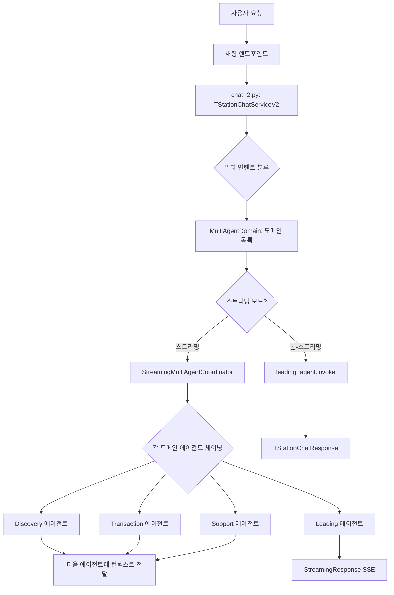
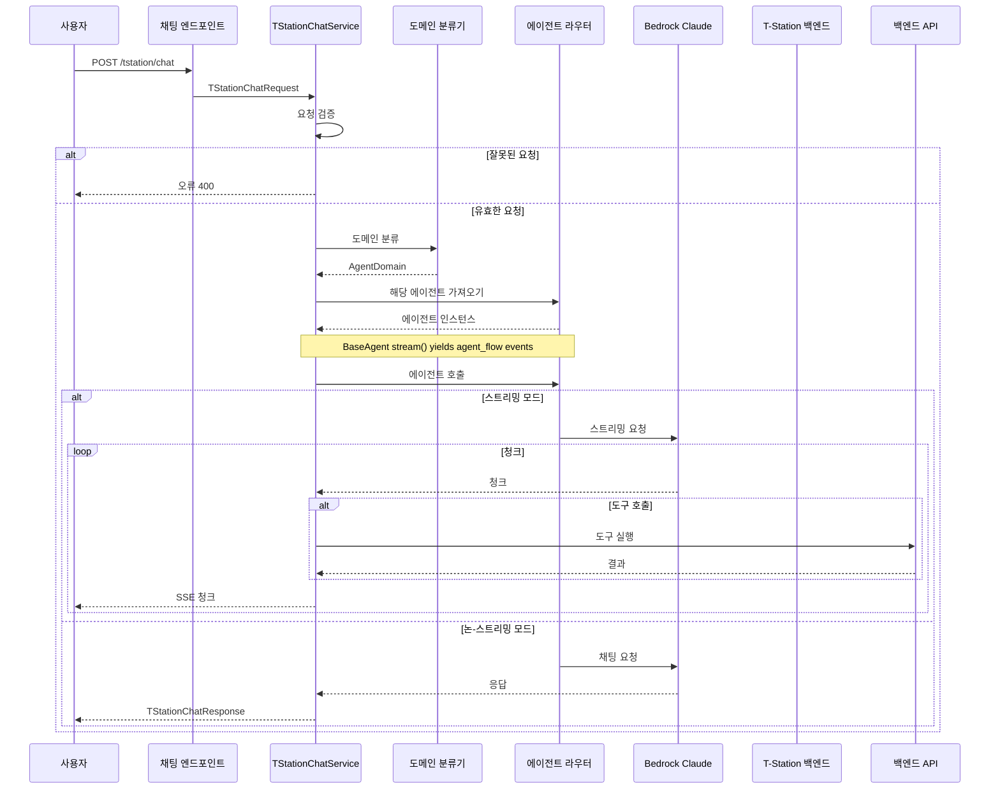

# T-Station AI Chat 문서

## 개요

T-Station AI는 Hankook Tire Korea를 위한 지능형 타이어 쇼핑 어시스턴트입니다. 이 서비스는 FastAPI를 통한 다중 도메인 채팅 기능을 제공하여 타이어에 대한 고객 문의를 처리합니다. 제품 권장 사항, 호환성 검사, 가격 조회, 매장 정보, FAQ 지원 및 주문 관리를 포함합니다.

**메인 파일**: `app/tstation-ai/services/tstation/chat.py`

## 기능

- ✅ V2 멀티 에이전트 스트리밍 및 다중 의도 감지
- ✅ 자동 다중 도메인 분류 (leading, discovery, pricing, order, support)
- ✅ 스트리밍 및 논-스트리밍 모드 지원
- ✅ LiteLLM과 LangChain 에이전트 통합
- ✅ GPT-5.4를 LLM으로 사용 (AI Gateway経由)
- ✅ Langfuse 추적 통합
- ✅ 백엔드 API 통합 (Oracle DB)
- ✅ BaseAgent와 TOOL_TO_AF_MAP을 통한 에이전트 기능 추적
- ✅ sub-agent start/done 이벤트가 포함된 스트리밍
- ✅ 체이닝된 에이전트 간 컨텍스트 전달

## 아키텍처



**메인 서비스**: `chat_2.py` with TStationChatServiceV2

## 워크플로 시퀀스



## 핵심 컴포넌트

### 1. BaseAgent (`base_agent.py`)

스트리밍 지원과 AF 매핑을 제공하는 모든 에이전트의 기본 클래스입니다.

```python
class BaseAgent(ABC):
    TOOL_TO_AF_MAP: dict[str, str] = {}

    def __init__(self, model, tools: list | None = None, system_prompt: str = "", name: str = ""):
        self.name = name
        self.agent = create_agent(
            model=model,
            tools=tools,
            debug=True,
            system_prompt=system_prompt,
            name=name,
        )

    def invoke(self, messages: list[dict]) -> str:
        result = self.agent.invoke({"messages": messages})
        return result["messages"][-1].content

    def stream(self, messages: list[dict]):
        tool_calls_map: dict[str, dict] = {}
        for mode, chunk in self.agent.stream(
            {"messages": messages},
            stream_mode=["messages", "updates"],
        ):
            if mode == "messages":
                token, _ = chunk
                if isinstance(token, AIMessageChunk) and token.text:
                    yield {"type": "token", "content": token.text}
            elif mode == "updates":
                for node, update in chunk.items():
                    message = update["messages"][-1]
                    if isinstance(message, AIMessage):
                        yield {"type": "message", "content": message.content, "node": node, "agent": self.name}
                    elif isinstance(message, ToolMessage):
                        af = self.TOOL_TO_AF_MAP.get(message.name, "Unknown")
                        tool_status = "success"
                        yield {"type": "agent_flow", "agent": f"[{af} AF]", "status": tool_status}
                        yield {"type": "tool", "input": {...}, "output": message.content, "node": node, "tool": message.name}
        yield {"type": "token", "content": "\n\n"}
```

**스트리밍 이벤트**:
- `token`: AI 응답 토큰 청크
- `message`: 노드와 에이전트 이름이 포함된 에이전트 메시지
- `agent_flow`: 도구 결과의 상태가 포함된 AF 레이블
- `tool`: 도구 이름, 입력, 출력이 포함된 도구 실행 결과

### 2. TStationChatService

모든 채팅 작업을 처리하는メイン 서비스 클래스입니다.

#### 메소드

##### `chat(request: TStationChatRequest)`

채팅 요청의 주요 진입점입니다.

**워크플로**:
1. 요청 검증
2. 메시지가 비어 있지 않은지 확인
3. 메시지 도메인 분류
4. 해당 에이전트 가져오기
5. 에이전트 호출 (스트리밍 또는 논-스트리밍)

**매개변수**:
- `request`: messages, stream, session_id를 포함하는 `TStationChatRequest`

**반환**:
- 논-스트리밍: `TStationChatResponse`
- 스트리밍: SSE 형식의 `StreamingResponse`

##### `classify_domain_request(request: TStationChatRequest) -> AgentDomain.Domain`

LLM을 사용하여 도메인을 구조화된 출력으로 분류합니다.

**지원 도메인**:
- `leading`: 인사, 일반 질문, 의도 불명확
- `discovery`: 제품 권장 사항, 호환성 검사, 제품 비교
- `pricing`: 가격 조회, 재고 확인, 매장 정보
- `order`: 구매 의도, 빠른 주문, 주문 추적
- `support`: 정책, 보증, 민원, 에스컬레이션

**분류 규칙**:
- 최고 우선순위: 에스컬레이션 → support
- 가격/재고/매장/주문 → transaction
- 권장 사항/호환성 → discovery
- 일반/불명확 → leading

**반환**:
- `AgentDomain.Domain` 열거형

##### `_stream_response(agent, request: TStationChatRequest)`

스트리밍 응답을 처리합니다.

**워크플로**:
1. 에이전트에서 스트리밍
2. JSON 이벤트Yield (agent_flow 포함)
3. 완료 시 [DONE] 전송

**SSE 형식**:
```json
{"type": "agent_flow", "agent": "[Discovery Agent]", "status": "success"}
{"type": "agent_flow", "agent": "[Product Compatibility AF]", "status": "success"}
{"type": "token", "content": "..."}
{"type": "tool", "tool": "get_compatibility_tool", "content": "..."}
```

### 3. AgentDomain

Pydantic을 사용한 도메인 분류 모델입니다.

```python
class AgentDomain(BaseModel):
    class Domain(str, Enum):
        LEADING = "leading"
        DISCOVERY = "discovery"
        TRANSACTION = "transaction"
        SUPPORT = "support"

    reason: str = Field(default="", description="Reason for the classification")
    confidence: float = Field(default=0.0, description="Confidence of the classification")
    domain: Domain = Field(default=Domain.LEADING, description="Domain of the conversation")
```

### 4. Router

도메인을 기반으로 에이전트를 라우팅합니다.

```python
def get_agent(self):
    if self.domain == self.Domain.DISCOVERY:
        return discovery_subagent
    elif self.domain == self.Domain.TRANSACTION:
        return transaction_subagent  # pricing + order merged
    elif self.domain == self.Domain.SUPPORT:
        return support_subagent
    else:
        return leading_agent
```

## 에이전트

모든 에이전트는 `BaseAgent`를 상속하고 `TOOL_TO_AF_MAP`을 정의합니다.

### Leading Agent (`a_leading_agent/`)

- 모든 채팅 요청의 중앙 오케스트레이터
- 인사, 일반 질문, 의도 불명확 처리
- 도메인이 일치하지 않을 때 폴백
- 도구 없음, 직접 LLM 응답

### Discovery Agent (`b_discovery_agent/`)

- 차량, 주행 조건에 따른 제품 권장 사항
- 타이어-차량 호환성 검사
- 상세 제품 설명

**TOOL_TO_AF_MAP**:
```python
TOOL_TO_AF_MAP = {
    "get_compatibility_tool": "Product Compatibility",
    "post_vehicle_verify_owner_tool": "Product Compatibility",
    "get_compatible_product_tool": "Product Compatibility",
    "get_user_vehicles_tool": "Product Compatibility",
    "get_products_recommendations_tool": "Product Recommendation",
    "get_product_description_tool": "Product Description",
}
```

### Transaction Agent (`c_transaction_agent/`)

- 가격 조회 (이전 pricing_agent 통합)
- 재고 확인 (물류, MD, 매장)
- 매장 정보 및 검색
- 주문 생성 및 추적 (이전 order_agent 통합)
- 배송 상태

### Support Agent (`e_support_agent/`)

- FAQ 조회
- 인간 상담원 에스컬레이션

**TOOL_TO_AF_MAP**:
```python
TOOL_TO_AF_MAP = {
    "get_faq_tool": "FAQ",
    "escalate_tool": "Escalation",
}
```

## Agent Flow Streaming

스트리밍 시 현재 활성 에이전트/AF를 보여주는 agent_flow 이벤트를 Yield합니다:

```python
# 에이전트 시작
{"type": "agent_flow", "agent": "[Discovery Agent]", "status": "success"}

# 도구 호출 - AF 상태 (도구 결과에서 추출)
{"type": "agent_flow", "agent": "[Product Compatibility AF]", "status": "success"}
{"type": "tool", "tool": "get_compatibility_tool", "content": "..."}

# 또 다른 도구
{"type": "agent_flow", "agent": "[Product Recommendation AF]", "status": "success"}
{"type": "tool", "tool": "get_products_recommendations_tool", "content": "..."}

# 최종 응답
{"type": "token", "content": "권장 타이어입니다..."}
```

**상태 색상 (UI)**:
- 성공: Green (#16a34a)
- 오류: Red (#dc2626)

## 시스템 프롬프트

### 도메인 분류 프롬프트

명확한 우선순위 규칙으로 메시지를 5개 도메인으로 분류합니다.

**우선순위 규칙**:
1. 에스컬레이션 요청 → support (최고)
2. 명확한 구매 의도 → order
3. 가격/재고/매장 → pricing
4. 권장 사항/호환성 → discovery
5. 일반/불명확 → leading

### 에이전트 프롬프트

각 에이전트는 자체 시스템 프롬프트를 가집니다:
- 역할과 기능
- 기능과 제한 사항
- 사용 가능한 도구
- 안전 규칙

## 요청/응답 모델

### TStationChatRequest

```python
class TStationChatRequest(BaseModel):
    messages: List[Union[HumanMessage, AIMessage, SystemMessage]]
    stream: bool = False
    session_id: Optional[str] = None
    user_id: Optional[str] = None
    metadata: Optional[dict] = None
```

### TStationChatResponse

```python
class TStationChatResponse(BaseModel):
    content: str
```

## 설정

| 환경 변수 | 설명 |
|-----------|------|
| ENV | 환경 모드 (local, dev, staging, prod) |
| AI_DEFAULT_PROVIDER | LLM 제공자 (기본값: openai) |
| REDIS_URL | 큐용 Redis 연결 |
| AWS_BEARER_TOKEN_BEDROCK | AWS Bedrock 인증 |

## 외부 통합

| 서비스 | 용도 | 제공자 |
|--------|------|--------|
| Bedrock Claude Haiku 4.5 | AI 응답용 LLM | AWS |
| LiteLLM | 통합 LLM 인터페이스 | LiteLLM |
| Langfuse | 추적 및 옵저버빌리티 | Langfuse |
| Redis | 큐 시스템 | Redis |
| Oracle | 제품/고객 데이터 | Oracle |

## 모니터링

- 헬스 체크: `/health` 엔드포인트
- 메트릭스: `/metrics`의 Prometheus 형식
- 추적: Langfuse 통합
- 로깅: 로그 레벨이 있는 구조화된 로깅

## 최근 변경 사항

### 현재 버전 (V2 멀티 에이전트 스트리밍)
- TStationChatServiceV2가 포함된 `chat_2.py` 추가
- 멀티 에이전트 체이닝을 위한 StreamingMultiAgentCoordinator 추가
- 다중 인텐트 감지를 위한 MultiAgentDomain 추가
- 체이닝된 에이전트 간 컨텍스트 전달 추가
- V2 스트리밍을 위한 sub-agent start/done 이벤트 추가
- 주 LLM으로 AI Gateway를 통한 GPT-5.4 (기존 Bedrock Claude Haiku 대체)
- 에이전트 응답에 줄 끝 문자 추가
