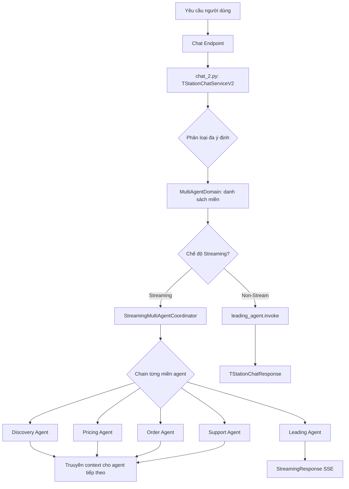
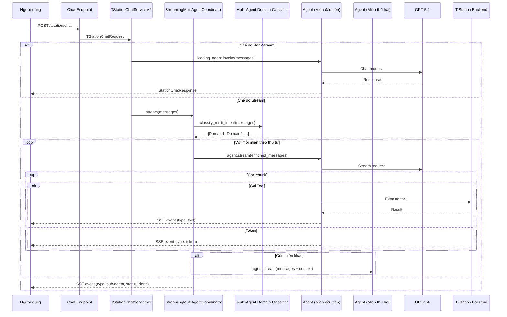

# T-Station AI Chat - Tài Liệu

## Tổng Quan

T-Station AI là trợ lý mua lốp xe thông minh cho Hankook Tire Korea. Dịch vụ này cung cấp khả năng chat đa miền với FastAPI để xử lý các câu hỏi của khách hàng về lốp xe, bao gồm: khuyến nghị sản phẩm, kiểm tra tương thích, tra giá, thông tin cửa hàng, hỗ trợ FAQ và quản lý đơn hàng.

**File chính**: `app/tstation-ai/services/tstation/chat_2.py`

## Tính Năng

- ✅ V2 multi-agent streaming và phát hiện đa ý định
- ✅ Phân loại đa miền tự động (leading, discovery, pricing, order, support)
- ✅ Hỗ trợ chế độ streaming và non-streaming
- ✅ Tích hợp LiteLLM với LangChain agents
- ✅ Sử dụng GPT-5.4 làm LLM (qua AI Gateway)
- ✅ Tích hợp Langfuse tracing
- ✅ Tích hợp Backend API (Oracle DB)
- ✅ BaseAgent với TOOL_TO_AF_MAP để theo dõi chức năng agent
- ✅ Streaming với sự kiện sub-agent start/done
- ✅ Truyền context giữa các agent được chain

## Kiến Trúc



**Hai phiên bản dịch vụ**:
- `chat.py`: Định tuyến đơn miền gốc (V1)
- `chat_2.py`: V2 multi-agent streaming với phát hiện đa ý định

## Workflow Sequence

### V2 Multi-Agent Streaming



## Các Thành Phần Cốt Lõi

### 1. BaseAgent (`base_agent.py`)

Lớp cơ sở cho tất cả agents với hỗ trợ streaming và AF mapping.

```python
class BaseAgent(ABC):
    TOOL_TO_AF_MAP: dict[str, str] = {}

    def __init__(self, model, tools: list | None = None, system_prompt: str = "", name: str = ""):
        self.name = name
        self.agent = create_agent(
            model=model,
            tools=tools,
            debug=True,
            system_prompt=system_prompt,
            name=name,
        )

    def invoke(self, messages: list[dict]) -> str:
        result = self.agent.invoke({"messages": messages})
        return result["messages"][-1].content

    def stream(self, messages: list[dict]):
        tool_calls_map: dict[str, dict] = {}
        for mode, chunk in self.agent.stream(
            {"messages": messages},
            stream_mode=["messages", "updates"],
        ):
            if mode == "messages":
                token, _ = chunk
                if isinstance(token, AIMessageChunk) and token.text:
                    yield {"type": "token", "content": token.text}
            elif mode == "updates":
                for node, update in chunk.items():
                    message = update["messages"][-1]
                    if isinstance(message, AIMessage):
                        yield {"type": "message", "content": message.content, "node": node, "agent": self.name}
                    elif isinstance(message, ToolMessage):
                        af = self.TOOL_TO_AF_MAP.get(message.name, "Unknown")
                        tool_status = "success"
                        yield {"type": "agent_flow", "agent": f"[{af} AF]", "status": tool_status}
                        yield {"type": "tool", "input": {...}, "output": message.content, "node": node, "tool": message.name}
        yield {"type": "token", "content": "\n\n"}
```

**Streaming Events**:
- `token`: Các token phản hồi AI
- `message`: Tin nhắn agent với node và agent name
- `agent_flow`: AF label với status từ tool result
- `tool`: Kết quả thực thi tool với tool name, input, output

### 2. TStationChatServiceV2 (`chat_2.py`)

Dịch vụ chat V2 với multi-agent streaming và phát hiện đa ý định.

**Khác biệt từ V1**:
- Phát hiện nhiều ý định (ví dụ: "giá và bảo hành" → PRICING + SUPPORT)
- Chain các agent tuần tự, truyền context giữa chúng
- Output của mỗi agent trở thành context cho agent tiếp theo

```python
class TStationChatServiceV2:
    @staticmethod
    def chat(request: TStationChatRequest):
        if request.stream:
            return StreamingResponse(
                TStationChatServiceV2._stream_response_multi(messages),
                media_type="text/event-stream",
            )
        content = leading_agent.invoke(messages)
        return TStationChatResponse(content=content)
```

### 3. StreamingMultiAgentCoordinator

Điều phối nhiều agents với việc truyền context.

```python
class StreamingMultiAgentCoordinator:
    def stream(self, messages: list[dict], domains: list | None = None):
        # 1. Phân loại đa ý định nếu domains không được cung cấp
        # 2. Với mỗi miền agent:
        #    - Yield sub-agent start event
        #    - Stream từ agent
        #    - Capture content để truyền context
        #    - Yield sub-agent done event
        # 3. Yield [DONE] cuối cùng
```

**Streaming Events (V2)**:
```json
{"type": "sub-agent", "agent": "[DISCOVERY AGENT]", "status": "start"}
{"type": "token", "content": "..."}
{"type": "agent_flow", "agent": "[Product Recommendation AF]", "status": "success"}
{"type": "tool", "tool": "get_products_recommendations_tool", "output": "..."}
{"type": "sub-agent", "agent": "[DISCOVERY AGENT]", "status": "done"}
{"type": "sub-agent", "agent": "[PRICING AGENT]", "status": "start"}
...
{"type": "sub-agent", "agent": "[DONE]", "status": "success"}
```

### 4. MultiAgentDomain

Model phân loại miền hỗ trợ nhiều miền.

```python
class MultiAgentDomain(BaseModel):
    class Domain(str, Enum):
        LEADING = "leading"
        DISCOVERY = "discovery"
        PRICING = "pricing"
        ORDER = "order"
        SUPPORT = "support"

    reason: str = Field(description="Lý do phân loại")
    domains: list[Domain] = Field(
        description="Danh sách các miền được phát hiện, theo thứ tự ưu tiên"
    )

    def get_agents(self):
        """Trả về danh sách agents dựa trên các miền được phát hiện."""
        return [agent_map[d] for d in self.domains if d in agent_map]
```

### 5. AgentDomain (V1)

Model phân loại miền gốc cho định tuyến đơn miền.

## Các Agent

Tất cả agents kế thừa từ `BaseAgent` và định nghĩa `TOOL_TO_AF_MAP`.

### Leading Agent (`a_leading_agent/`)

- Điều phối trung tâm cho tất cả yêu cầu chat
- Xử lý lời chào, câu hỏi chung, ý định không rõ
- Fallback khi không có miền nào khớp
- Không có tools, phản hồi trực tiếp từ LLM

### Discovery Agent (`b_discovery_agent/`)

- Khuyến nghị sản phẩm dựa trên xe, điều kiện lái
- Kiểm tra tương thích lốp-xe
- Mô tả chi tiết sản phẩm

**TOOL_TO_AF_MAP**:
```python
TOOL_TO_AF_MAP = {
    "get_compatibility_tool": "Product Compatibility",
    "post_vehicle_verify_owner_tool": "Product Compatibility",
    "get_compatible_product_tool": "Product Compatibility",
    "get_user_vehicles_tool": "Product Compatibility",
    "get_products_recommendations_tool": "Product Recommendation",
    "get_product_description_tool": "Product Description",
}
```

### Pricing Agent (`c_pricing_agent/`)

- Tra giá
- Kiểm tra tồn kho (logistics, MD, cửa hàng)
- Thông tin cửa hàng

**TOOL_TO_AF_MAP**:
```python
TOOL_TO_AF_MAP = {
    "get_final_price_tool": "Price",
    "get_logistics_inventory_tool": "Inventory",
    "get_md_inventory_tool": "Inventory",
    "get_store_inventory_tool": "Inventory",
    "get_nearby_stores_tool": "Store",
    "get_store_list_tool": "Store",
    "get_store_detail_tool": "Store",
}
```

### Order Agent (`d_order_agent/`)

- Tạo đơn hàng nhanh
- Theo dõi đơn hàng
- Trạng thái giao hàng

**TOOL_TO_AF_MAP**:
```python
TOOL_TO_AF_MAP = {
    "get_nearby_stores_tool": "Store",
    "get_store_details_tool": "Store",
    "get_store_list_tool": "Store",
    "create_order_draft_tool": "Quick Order",
    "get_order_status_tool": "Order / Delivery",
}
```

### Support Agent (`e_support_agent/`)

- Tra cứu FAQ
- Kết nối với tư vấn viên

**TOOL_TO_AF_MAP**:
```python
TOOL_TO_AF_MAP = {
    "get_faq_tool": "FAQ",
    "escalate_tool": "Escalation",
}
```

## Agent Flow Streaming

Khi streaming, service yield các sự kiện agent_flow cho thấy agent/AF đang hoạt động:

```python
# Agent bắt đầu
{"type": "agent_flow", "agent": "[Discovery Agent]", "status": "success"}

# Tool được gọi - AF status từ tool result
{"type": "agent_flow", "agent": "[Product Compatibility AF]", "status": "success"}
{"type": "tool", "tool": "get_compatibility_tool", "content": "..."}

# Tool khác
{"type": "agent_flow", "agent": "[Product Recommendation AF]", "status": "success"}
{"type": "tool", "tool": "get_products_recommendations_tool", "content": "..."}

# Phản hồi cuối cùng
{"type": "token", "content": "Dưới đây là các lốp được khuyến nghị..."}
```

**Màu trạng thái (UI)**:
- Thành công: Green (#16a34a)
- Lỗi: Red (#dc2626)

## System Prompts

### V1 Domain Classification Prompt (Đơn Ý Định)

Phân loại tin nhắn thành 5 miền với quy tắc ưu tiên rõ ràng.

**Quy tắc ưu tiên**:
1. Yêu cầu escalation → support (cao nhất)
2. Ý định mua rõ ràng → order
3. Giá/Tồn kho/Cửa hàng → pricing
4. Khuyến nghị/Tương thích → discovery
5. Chung/Không rõ → leading

### V2 Multi-Intent Classification Prompt

Phát hiện TẤT CẢ các miền liên quan trong một yêu cầu.

**Ví dụ phát hiện đa ý định**:
- "Giải thích Ventus S1 evo3 và cho biết giá" → DISCOVERY + PRICING
- "Tìm lốp cho BMW của tôi và kiểm tra còn hàng không" → DISCOVERY + PRICING
- "Khuyến nghị lốp và bảo hành của chúng" → DISCOVERY + SUPPORT
- "Giá của lốp này bao nhiêu? Bảo hành thế nào?" → PRICING + SUPPORT

## Request/Response Models

### TStationChatRequest

```python
class TStationChatRequest(BaseModel):
    messages: list[dict]  # Danh sách tin nhắn với role/content
    stream: bool = False  # Cờ chế độ streaming
    user_id: str  # User ID
    session_id: str  # Session ID
    access_token: Optional[str] = None  # Access token cho tstation-be API
    tracing_id: str = uuid.uuid4().hex  # Tracing ID
    metadata: Optional[Dict[str, Any]] = {}  # Metadata bổ sung
```

### TStationChatResponse

```python
class TStationChatResponse(BaseModel):
    content: str  # Nội dung phản hồi chat
```

## Cấu Hình

| Biến Môi Trường | Mô Tả |
|-----------------|-------|
| ENV | Chế độ môi trường (local, dev, staging, prod) |
| AI_GATEWAY_BASE_URL | AI Gateway API base URL |
| AI_GATEWAY_API_KEY | AI Gateway API key |
| REDIS_URL | Kết nối Redis cho queue |
| AWS_BEARER_TOKEN_BEDROCK | AWS Bedrock authentication (legacy) |

## Tích Hợp Bên Ngoài

| Dịch Vụ | Mục Đích | Nhà Cung Cấp |
|---------|---------|--------------|
| GPT-5.4 | LLM cho phản hồi AI | OpenAI (qua AI Gateway) |
| LiteLLM | Giao diện LLM thống nhất | LiteLLM |
| Langfuse | Tracing và quan sát | Langfuse |
| Redis | Hệ thống queue | Redis |
| Oracle | Dữ liệu sản phẩm/khách hàng | Oracle |

## Monitoring

- Health checks: endpoint `/health`
- Metrics: định dạng Prometheus tại `/metrics`
- Tracing: tích hợp Langfuse
- Logging: structured logging với các log levels

## Thay Đổi Gần Đây

### Phiên Bản Hiện Tại (V2 Multi-Agent Streaming)
- Thêm `chat_2.py` với TStationChatServiceV2
- Thêm StreamingMultiAgentCoordinator cho việc chain multi-agent
- Thêm MultiAgentDomain cho phát hiện đa ý định
- Thêm truyền context giữa các agent được chain
- Thêm sự kiện sub-agent start/done cho V2 streaming
- GPT-5.4 qua AI Gateway làm LLM chính (trước đây là Bedrock Claude Haiku)
- Thêm dòng mới ở cuối phản hồi agent
