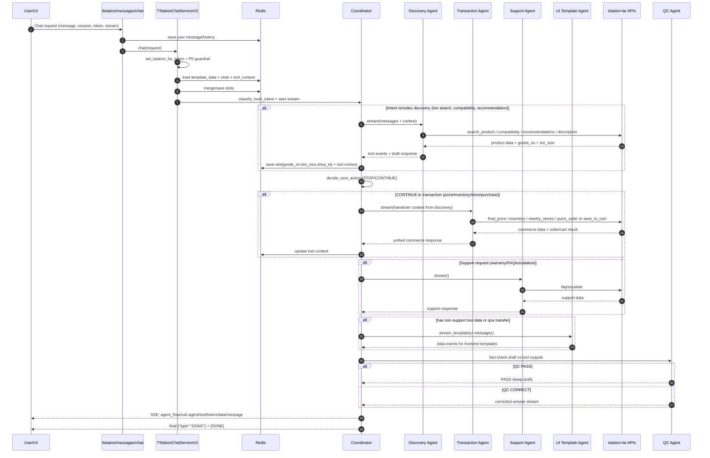

# T-Station AI Full Architecture (Mermaid)

This document compiles two important architecture diagrams into one place:

1. Overall System Design (service, data, integrations).
2. AI orchestration + end-to-end tire purchase flow.

## 1) Architecture Diagram (System Design)

```mermaid
flowchart TB
    subgraph Client
      U[User]
      UI[tstation-ui-demo Streamlit]
      U --> UI
      UI --> U
    end

    subgraph AI["tstation-ai FastAPI"]
      EP[Chat Endpoint<br/>POST /tstation/messages/chat]
      SESS[Session APIs<br/>/tstation/messages/sessions<br/>/history/{session_id}]
      CS[TStationChatServiceV2]
      CO[StreamingMultiAgentCoordinator]
      QC[QC Agent]
      UT[UI Template Agent]
      HS[ChatHistoryService]
      EP --> CS --> CO
      SESS --> HS
      CO --> QC
      CO --> UT
      CS --> HS
    end

    subgraph Agents["Multi-Agent Layer"]
      L[a_leading_agent]
      D[b_discovery_agent]
      T[c_transaction_agent]
      S[e_support_agent]
    end

    subgraph External
      LLM[LiteLLM / AI Gateway]
      REDIS[(Redis: history/slots/tool_ctx)]
      QDRANT[(Qdrant: RAG)]
      BE[tstation-be APIs via OpenAPI client]
      ORACLE[(Oracle DB)]
      LANG[Langfuse config/tracing]
    end

    UI -->|POST /api/tstation/messages/chat SSE| EP
    UI -->|GET/DELETE session APIs| SESS
    EP -->|SSE: token/tool/data/message + DONE| UI
    CO --> L
    CO --> D
    CO --> T
    CO --> S

    L --> LLM
    D --> LLM
    T --> LLM
    S --> LLM

    HS --> REDIS
    D --> QDRANT
    D --> BE
    T --> BE
    S --> BE
    BE --> ORACLE
    CS --> LANG
```

## 2) Sequence Diagram



## Validation Notes Based on Code

- The repo currently does not contain the actual running source code for `app/tstation-be`; the AI service calls the BE via a generated OpenAPI client.
- The actual chat endpoint is `/tstation/messages/chat` in `api/tstation/chat_message.py` (mounted by `api/router.py`).
- The UI demo currently has differences in the base URL between modules (`chat.py` uses `/api`, while `sessions.py` does not), so the diagram reflects the primary chat calling path.
- The sequence has been updated to include the `UI Template Agent` step and the finalize stream (`DONE` + `[DONE]`), consistent with `_stream_response_multi()`.
