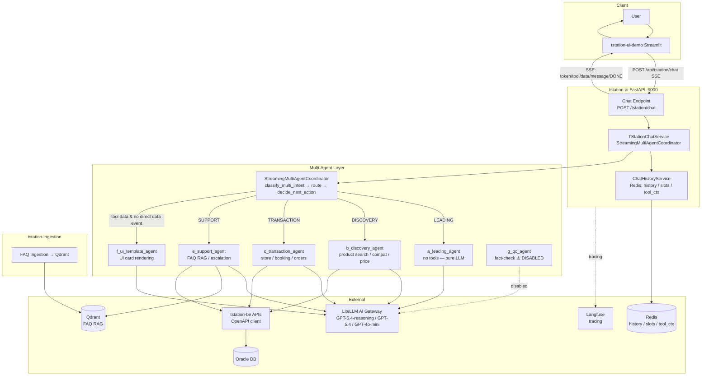
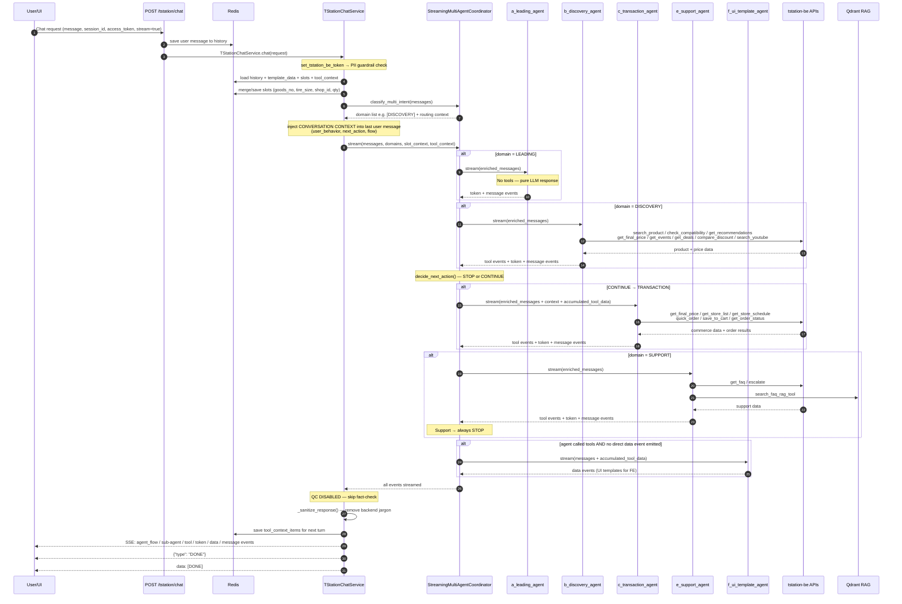

# T-Station AI Full Architecture (Mermaid)

This document compiles two important architecture diagrams:

1. Overall System Design (services, data, integrations).
2. AI orchestration + end-to-end chat flow.

## 1) Architecture Diagram (System Design)



## 2) Sequence Diagram — Full Agent Flow



## 3) SSE Event Schema (FE Contract)

```
data: {"type": "agent_flow",  "agent": "[응답 생성 중]",   "status": "processing"}
data: {"type": "status",      "status": "생각 중..."}
data: {"type": "status",      "status": "tool_start", "tool": "search_product_tool", "display_name": "상품 검색 중..."}
data: {"type": "agent_flow",  "agent": "[PRICE AF]",        "status": "success"}
data: {"type": "token",       "content": "안녕하세요..."}
data: {"type": "tool",        "tool": "get_final_price_tool", "input": {...}, "output": "..."}
data: {"type": "message",     "content": "...", "agent": "[TRANSACTION AGENT]"}
data: {"type": "data",        "template": "product", "data": {"assistantResponse": "...", "meta": {...}, "items": [...]}}
data: {"type": "sub-agent",   "agent": "[DONE]",            "status": "success"}
data: {"type": "DONE"}
data: [DONE]
```
