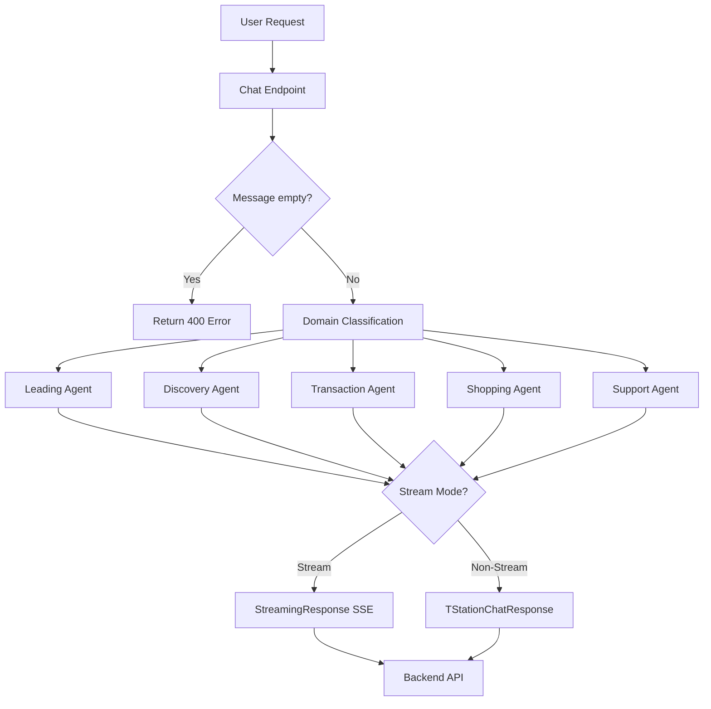
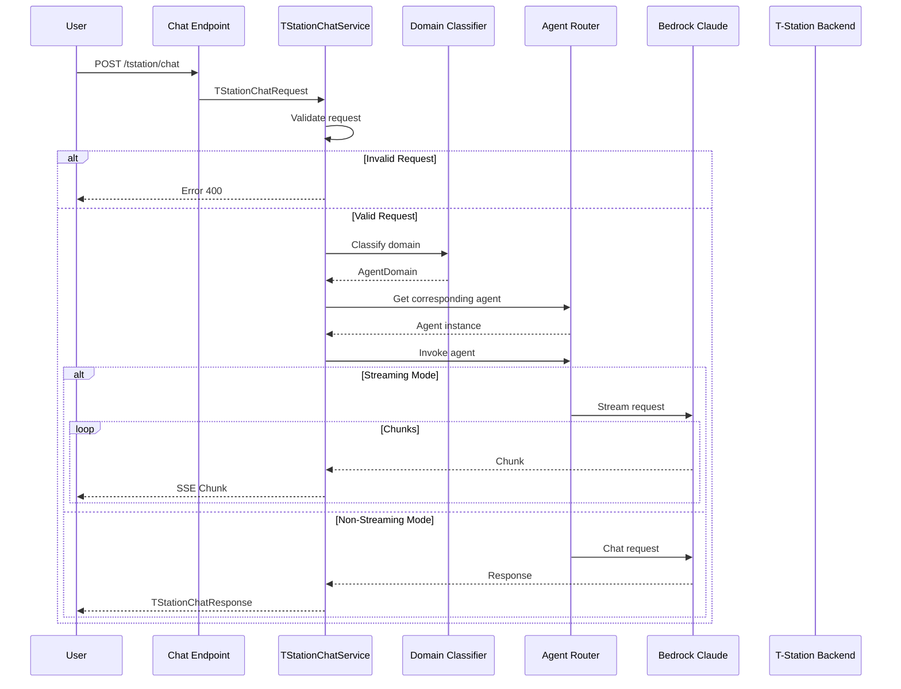

# T-Station AI Chat Documentation

## Overview

T-Station AI is an intelligent tire shopping assistant for Hankook Tire Korea. This service provides multi-domain chat capabilities with FastAPI to handle customer inquiries about tires, including product recommendations, compatibility checks, FAQ support, and store information.

**Main file**: `app/tstation-ai/services/tstation/chat.py`

## Features

- Multi-agent architecture with intelligent routing
- Automatic domain classification (leading, discovery, transaction, shopping, support)
- Support for streaming and non-streaming modes
- LangChain agents integration with LiteLLM
- Bedrock Claude Haiku 4.5 as LLM
- Langfuse tracing integration
- Backend API integration (Oracle DB)

## Architecture



## Workflow Sequence



## Core Components

### 1. TStationChatService

Main service class handling all chat operations.

#### Methods

##### `chat(request: TStationChatRequest)`

Main entry point for chat requests.

**Workflow**:
1. Validate request
2. Check messages not empty
3. Classify message domain
4. Get corresponding agent
5. Invoke agent (stream or non-stream)

**Parameters**:
- `request`: `TStationChatRequest` containing messages, stream, session_id

**Returns**:
- Non-stream: `TStationChatResponse`
- Stream: `StreamingResponse` with SSE format

##### `classify_domain_request(request: TStationChatRequest) -> AgentDomain.Domain`

Classifies message domain using LLM with structured output.

**Supported domains**:
- `leading`: Greetings, general questions, unclear intent
- `discovery`: Product recommendations, compatibility checks, product comparisons
- `transaction`: Purchasing, order management, order tracking
- `shopping`: Pricing, stock, promotions, store information
- `support`: Policies, warranty, complaints, escalation

**Classification rules**:
- Highest priority: Escalation → support
- Clear purchase intent → transaction
- Price/Stock/Store → shopping
- Recommendation/Compatibility → discovery
- Unclear → leading

**Returns**:
- `AgentDomain.Domain` enum

##### `_stream_response(agent, request: TStationChatRequest)`

Handles streaming response.

**Workflow**:
1. Stream from agent
2. Yield JSON events
3. Send [DONE] when complete

**SSE Format**:
```json
{
  "type": "message",
  "data": {...}
}
```

### 2. AgentDomain

Domain classification model with Pydantic.

```python
class AgentDomain(BaseModel):
    class Domain(str, Enum):
        LEADING = "leading"
        DISCOVERY = "discovery"
        TRANSACTION = "transaction"
        SHOPPING = "shopping"
        SUPPORT = "support"

    reason: str = Field(default="", description="Reason for the classification")
    confidence: float = Field(default=0.0, description="Confidence of the classification")
    domain: Domain = Field(default=Domain.LEADING, description="Domain of the conversation")
```

### 3. Router

Routes agent based on domain.

```python
def get_agent(self):
    if self.domain == self.Domain.DISCOVERY:
        return discovery_subagent
    elif self.domain == self.Domain.TRANSACTION:
        return transaction_subagent
    elif self.domain == self.Domain.SHOPPING:
        return shopping_subagent
    elif self.domain == self.Domain.SUPPORT:
        return support_subagent
    else:
        return leading_agent
```

## Agents

### Leading Agent (`a_leading_agent/`)

- Central orchestrator for all chat requests
- Handles greeting, general questions, unclear intent
- Fallback when no domain matches

### Discovery Agent (`b_discovery_agent/`)

- Product recommendations based on vehicle, driving conditions
- Tire-vehicle compatibility checks
- Detailed product descriptions

### Transaction Agent (`c_transaction_agent/`)

- Handles clear purchase intent
- Order management
- Order tracking
- Order cancellation

### Shopping Agent (`d_shopping_agent/`)

- Price lookup
- Stock checking
- Promotions, coupons
- Store information

### Support Agent (`e_support_agent/`)

- Warranty policies
- Return policies
- Complaints
- Escalation (connect to human agent)

## System Prompts

### Domain Classification Prompt

Classifies messages into 5 domains with clear priority rules.

**Priority Rules**:
1. Escalation request → support (highest)
2. Clear purchase intent → transaction
3. Price/Stock/Store → shopping
4. Recommendation/Compatibility → discovery
5. General/Unclear → leading

### Agent Prompts

Each agent has its own system prompt defining:
- Role and function
- Capabilities and limitations
- Available tools
- Safety rules

## Request/Response Models

### TStationChatRequest

```python
class TStationChatRequest(BaseModel):
    messages: List[Union[HumanMessage, AIMessage, SystemMessage]]
    stream: bool = False
    session_id: Optional[str] = None
```

### TStationChatResponse

```python
class TStationChatResponse(BaseModel):
    content: str
```

## Configuration

| Environment | Description |
|-------------|-------------|
| LOCAL | Local development |
| DEV | Development server |
| STAGING | Staging environment |
| PROD | Production |

## External Integrations

| Service | Purpose | Provider |
|---------|---------|----------|
| Bedrock Claude Haiku 4.5 | LLM for AI responses | AWS |
| LiteLLM | Unified LLM interface | LiteLLM |
| Langfuse | Tracing and observability | Langfuse |
| Redis | Queue system | Redis |
| Oracle | Product/customer data | Oracle |

## Monitoring

- Health checks: `/health` endpoint
- Metrics: Prometheus format at `/metrics`
- Tracing: Langfuse integration
- Logging: Structured logging with log levels
