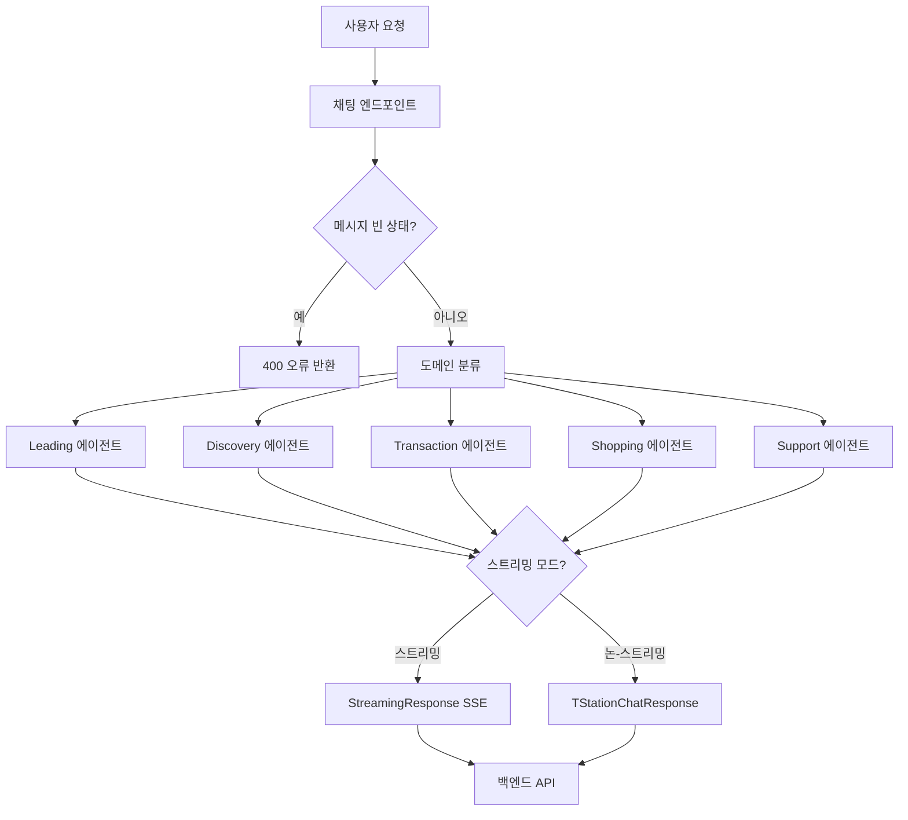
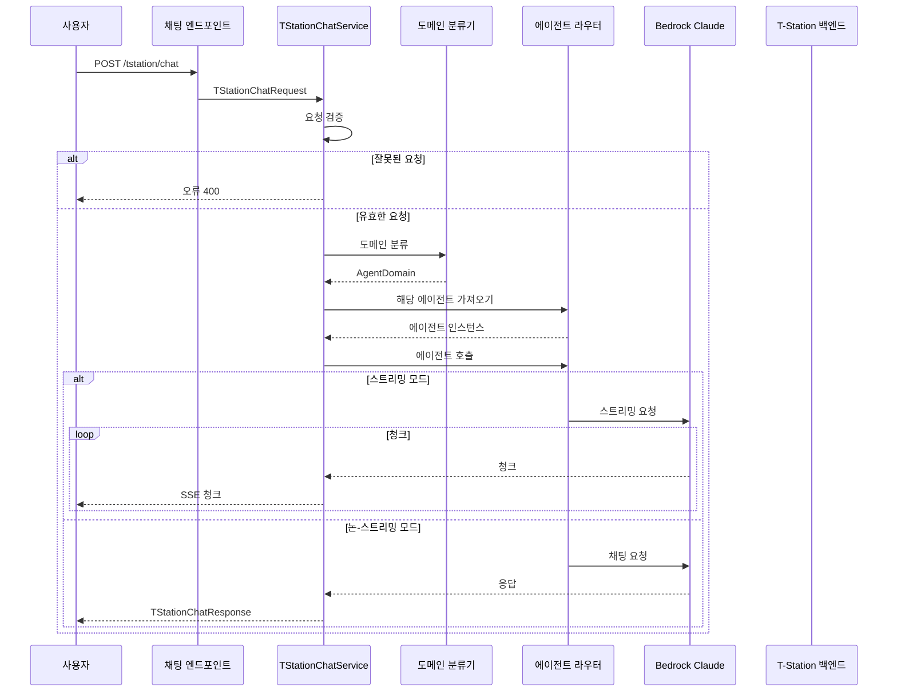

# T-Station AI Chat 문서

## 개요

T-Station AI는 Hankook Tire Korea를 위한 지능형 타이어 쇼핑 어시스턴트입니다. 이 서비스는 FastAPI를 통한 다중 도메인 채팅 기능을 제공하여 타이어에 대한 고객 문의를 처리합니다. 제품 권장 사항, 호환성 검사, FAQ 지원 및 매장 정보를 포함합니다.

**메인 파일**: `app/tstation-ai/services/tstation/chat.py`

## 기능

- 지능형 라우팅을 통한 다중 에이전트 아키텍처
- 자동 도메인 분류 (leading, discovery, transaction, shopping, support)
- 스트리밍 및 논-스트리밍 모드 지원
- LiteLLM과 LangChain 에이전트 통합
- Bedrock Claude Haiku 4.5를 LLM으로 사용
- Langfuse 추적 통합
- 백엔드 API 통합 (Oracle DB)

## 아키텍처



## 워크플로 시퀀스



## 핵심 컴포넌트

### 1. TStationChatService

모든 채팅 작업을 처리하는メイン 서비스 클래스입니다.

#### 메소드

##### `chat(request: TStationChatRequest)`

채팅 요청의 주요 진입점입니다.

**워크플로**:
1. 요청 검증
2. 메시지가 비어 있지 않은지 확인
3. 메시지 도메인 분류
4. 해당 에이전트 가져오기
5. 에이전트 호출 (스트리밍 또는 논-스트리밍)

**매개변수**:
- `request`: messages, stream, session_id를 포함하는 `TStationChatRequest`

**반환**:
- 논-스트리밍: `TStationChatResponse`
- 스트리밍: SSE 형식의 `StreamingResponse`

##### `classify_domain_request(request: TStationChatRequest) -> AgentDomain.Domain`

LLM을 사용하여 도메인을 구조화된 출력으로 분류합니다.

**지원 도메인**:
- `leading`: 인사, 일반 질문, 의도 불명확
- `discovery`: 제품 권장 사항, 호환성 검사, 제품 비교
- `transaction`: 구매, 주문 관리, 주문 추적
- `shopping`: 가격, 재고, 프로모션, 매장 정보
- `support`: 정책, 보증, 민원, 에스컬레이션

**분류 규칙**:
- 최고 우선순위: 에스컬레이션 → support
- 명확한 구매 의도 → transaction
- 가격/재고/매장 → shopping
- 권장 사항/호환성 → discovery
- 일반/불명확 → leading

**반환**:
- `AgentDomain.Domain` 열거형

##### `_stream_response(agent, request: TStationChatRequest)`

스트리밍 응답을 처리합니다.

**워크플로**:
1. 에이전트에서 스트리밍
2. JSON 이벤트Yield
3. 완료 시 [DONE] 전송

**SSE 형식**:
```json
{
  "type": "message",
  "data": {...}
}
```

### 2. AgentDomain

Pydantic을 사용한 도메인 분류 모델입니다.

```python
class AgentDomain(BaseModel):
    class Domain(str, Enum):
        LEADING = "leading"
        DISCOVERY = "discovery"
        TRANSACTION = "transaction"
        SHOPPING = "shopping"
        SUPPORT = "support"

    reason: str = Field(default="", description="Reason for the classification")
    confidence: float = Field(default=0.0, description="Confidence of the classification")
    domain: Domain = Field(default=Domain.LEADING, description="Domain of the conversation")
```

### 3. Router

도메인을 기반으로 에이전트를 라우팅합니다.

```python
def get_agent(self):
    if self.domain == self.Domain.DISCOVERY:
        return discovery_subagent
    elif self.domain == self.Domain.TRANSACTION:
        return transaction_subagent
    elif self.domain == self.Domain.SHOPPING:
        return shopping_subagent
    elif self.domain == self.Domain.SUPPORT:
        return support_subagent
    else:
        return leading_agent
```

## 에이전트

### Leading Agent (`a_leading_agent/`)

- 모든 채팅 요청의 중앙 오케스트레이터
- 인사, 일반 질문, 의도 불명확 처리
- 도메인이 일치하지 않을 때 폴백

### Discovery Agent (`b_discovery_agent/`)

- 차량, 주행 조건에 따른 제품 권장 사항
- 타이어-차량 호환성 검사
- 상세 제품 설명

### Transaction Agent (`c_transaction_agent/`)

- 명확한 구매 의도 처리
- 주문 관리
- 주문 추적
- 주문 취소

### Shopping Agent (`d_shopping_agent/`)

- 가격 조회
- 재고 확인
- 프로모션, 쿠폰
- 매장 정보

### Support Agent (`e_support_agent/`)

- 보증 정책
- 반품 정책
- 민원
- 에스컬레이션 (인간 상담원 연결)

## 시스템 프롬프트

### 도메인 분류 프롬프트

명확한 우선순위 규칙으로 메시지를 5개 도메인으로 분류합니다.

**우선순위 규칙**:
1. 에스컬레이션 요청 → support (최고)
2. 명확한 구매 의도 → transaction
3. 가격/재고/매장 → shopping
4. 권장 사항/호환성 → discovery
5. 일반/불명확 → leading

### 에이전트 프롬프트

각 에이전트는 자체 시스템 프롬프트를 가집니다:
- 역할과 기능
- 기능과 제한 사항
- 사용 가능한 도구
- 안전 규칙

## 요청/응답 모델

### TStationChatRequest

```python
class TStationChatRequest(BaseModel):
    messages: List[Union[HumanMessage, AIMessage, SystemMessage]]
    stream: bool = False
    session_id: Optional[str] = None
```

### TStationChatResponse

```python
class TStationChatResponse(BaseModel):
    content: str
```

## 설정

| 환경 | 설명 |
|------|------|
| LOCAL | 로컬 개발 |
| DEV | 개발 서버 |
| STAGING | 스테이징 환경 |
| PROD | 프로덕션 |

## 외부 통합

| 서비스 | 용도 | 제공자 |
|--------|------|--------|
| Bedrock Claude Haiku 4.5 | AI 응답용 LLM | AWS |
| LiteLLM | 통합 LLM 인터페이스 | LiteLLM |
| Langfuse | 추적 및 옵저버빌리티 | Langfuse |
| Redis | 큐 시스템 | Redis |
| Oracle | 제품/고객 데이터 | Oracle |

## 모니터링

- 헬스 체크: `/health` 엔드포인트
- 메트릭스: `/metrics`의 Prometheus 형식
- 추적: Langfuse 통합
- 로깅: 로그 레벨이 있는 구조화된 로깅
